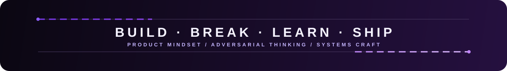

 

**Building security systems, developer intelligence, and research software with product-level execution.**

 

  

 

  <h2>◆ SELECTED SYSTEMS ◆</h2>
  
<i>Projects where product, systems engineering, data, and AI meet.</i>

<table>
<tr>
<td width="50%" valign="top">
<h3>01 · TGDetect</h3>
<b>Temporal graph security detection &amp; investigation.</b>
  
Turns raw cybersecurity telemetry into temporal heterogeneous graphs, causal attack chains, and forensic investigation surfaces. Its detection pipeline combines GraphSAGE + GRU for multi-stage threat analysis while keeping live telemetry distinct from offline model benchmarks.
  
<code>Python</code> <code>PyTorch</code> <code>PyG</code> <code>GraphSAGE</code> <code>FastAPI</code> <code>Next.js</code>
  

</td>
<td width="50%" valign="top">
<h3>02 · Verbis</h3>
<b>AI database assistant that lives inside VS Code.</b>
  
Transforms natural-language questions into SQL/NoSQL, explores schemas, generates ER diagrams, tracks query history, and adds privacy controls such as schema anonymization and PII masking. Supports cloud and local LLM workflows.
  
<code>TypeScript</code> <code>React</code> <code>Python</code> <code>FastAPI</code> <code>VS Code API</code>
  

</td>
</tr>
<tr>
<td width="50%" valign="top">
<h3>03 · ScholarNexus</h3>
<b>The Evidence Desk — local-first scholarly research workspace.</b>
  
Searches academic providers directly, preserves source passages with provenance, supports screening and evidence matrices, and exports reproducible research records. The baseline research workflow remains usable with AI disabled.
  
<code>Next.js</code> <code>TypeScript</code> <code>PostgreSQL</code> <code>Prisma</code> <code>Research APIs</code>
  

</td>
<td width="50%" valign="top">
<h3>04 · ShetVaidya</h3>
<b>AI crop-disease analysis &amp; medicine verification.</b>
  
A production-oriented multi-service system combining MobileNetV2 inference, location-aware disease analysis, authenticated scan history, image storage, and agricultural medicine verification.
  
<code>React</code> <code>FastAPI</code> <code>TensorFlow</code> <code>PostgreSQL</code> <code>Redis</code> <code>R2</code>
  

</td>
</tr>
</table>

<a href="https://github.com/Pratham2511?tab=repositories"><b>Explore every repository →</b></a>

 

  <h2>◆ ENGINEERING STACK ◆</h2>
  
<i>Tools I actually build with, grouped by where they matter.</i>

  <b>LANGUAGES</b>
    
  
  
  
  

    
  <b>PRODUCT & SYSTEMS</b>
    
  
  
  
  
  
  
  

    
  <b>AI / ML</b>
    
  
  
  
  

    
  <b>DELIVERY & DESIGN</b>
    
  
  
  
  

 

  <h2>◆ CURRENT SIGNAL ◆</h2>

> **Security systems** — temporal graph learning, threat detection, and investigation interfaces that preserve data truth.
>
> **Developer intelligence** — AI tooling that fits into real workflows instead of becoming another disconnected chat surface.
>
> **Research infrastructure** — provenance-first software where reproducibility, evidence, and source integrity matter more than generated filler.
>
> **Product engineering** — shipping across interface, API, data, infrastructure, and ML boundaries instead of treating them as separate worlds.

 

### OPEN CHANNEL

I’m interested in technically ambitious work around **AI security, developer tooling, research infrastructure, and applied ML**.

  

<i>Build like a product. Secure like an adversary.</i>

  

